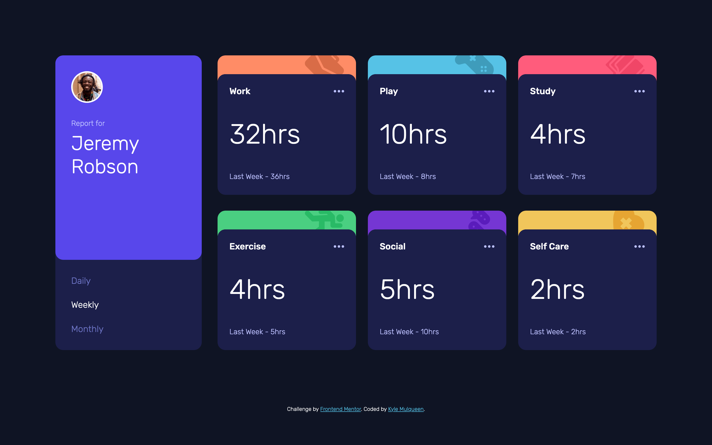
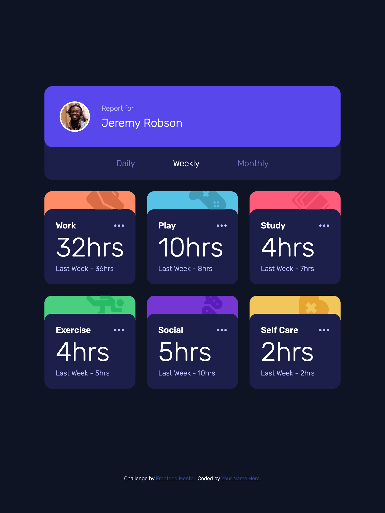
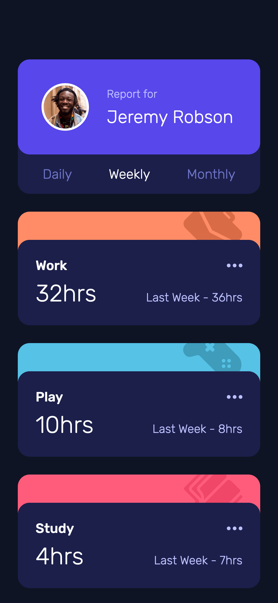

# Frontend Mentor - Time tracking dashboard solution

This is a solution to the [Time tracking dashboard challenge on Frontend Mentor](https://www.frontendmentor.io/challenges/time-tracking-dashboard-UIQ7167Jw). Frontend Mentor challenges help you improve your coding skills by building realistic projects.

## Table of contents

- [Frontend Mentor - Time tracking dashboard solution](#frontend-mentor---time-tracking-dashboard-solution)
  - [Table of contents](#table-of-contents)
  - [Overview](#overview)
    - [The challenge](#the-challenge)
    - [Screenshot](#screenshot)
    - [Links](#links)
  - [My process](#my-process)
    - [Built with](#built-with)
    - [What I learned](#what-i-learned)
    - [Continued development](#continued-development)
    - [Useful resources](#useful-resources)
  - [Author](#author)

## Overview

### The challenge

Users should be able to:

- View the optimal layout for the site depending on their device's screen size
- See hover states for all interactive elements on the page
- Switch between viewing Daily, Weekly, and Monthly stats

### Screenshot

**Desktop**

**Tablet**

**Mobile**


### Links

- Solution URL: [Add solution URL here](https://your-solution-url.com)
- Live Site URL: [Add live site URL here](https://your-live-site-url.com)

## My process

### Built with

- Semantic HTML5 markup
- CSS custom properties
- Flexbox
- CSS Grid
- Mobile-first workflow
- JavaScript

### What I learned

Throughout this project, I gained significant experience with several front-end techniques:

1. **SVG in CSS Pseudo-elements** - I learned how to incorporate SVG icons as background images in `::before` pseudo-elements and the challenges this presents:

```css
.card::before {
  content: "";
  display: block;
  width: 5rem;
  height: 5rem;
  background-image: url("./images/icon-work.svg");
  background-size: contain;
  background-repeat: no-repeat;
  position: absolute;
}
```

2. **Clip Path for UI Elements** - I discovered how to use `clip-path` to precisely control which portions of an element are visible:

```css
.card--work::before {
  clip-path: polygon(
    0 1rem,
    100% 1rem,
    100% calc(var(--lh-500) + 1rem),
    0 calc(var(--lh-500) + 1rem)
  );
}
```

3. **Asynchronous JavaScript** - Working with `async/await` to fetch and process JSON data:

```js
async function getAllData() {
  const res = await fetch("./data.json");
  const data = await res.json();
  return data;
}
```

4. **Event Delegation and State Management** - Managing application state based on user input through radio buttons.

### Continued development

Moving forward, I want to focus on:

1. **Better Error Handling** - Adding more robust error handling for asynchronous operations and data fetching.

2. **Component Abstraction** - Creating reusable components rather than repeating similar HTML structures.

3. **CSS Layout Techniques** - Further exploring layout methods like CSS Grid for responsive designs.

4. **JavaScript Optimization** - Improving performance by minimizing DOM operations and optimizing data processing.

5. **Accessibility** - While I included screen reader text and semantic HTML, I want to improve keyboard navigation and ARIA implementations.

### Useful resources

- [CSS-Tricks: Clipping and Masking in CSS](https://css-tricks.com/clipping-masking-css/) - This resource was invaluable for understanding how to implement the clip-path solution for my icon display problems.

- [JavaScript.info: Async/await](https://javascript.info/async-await) - Clear explanations of asynchronous JavaScript that helped me structure my data fetching code.

- [Inclusive Components](https://inclusive-components.design/toggle-button/) - Guidance on creating accessible form controls that influenced my radio button implementation.

## Author

- Website - [Kyle Mulqueen](https://kmulqueen.github.io/portfolio-2025/)
- Frontend Mentor - [@kmulqueen](https://www.frontendmentor.io/profile/kmulqueen)
